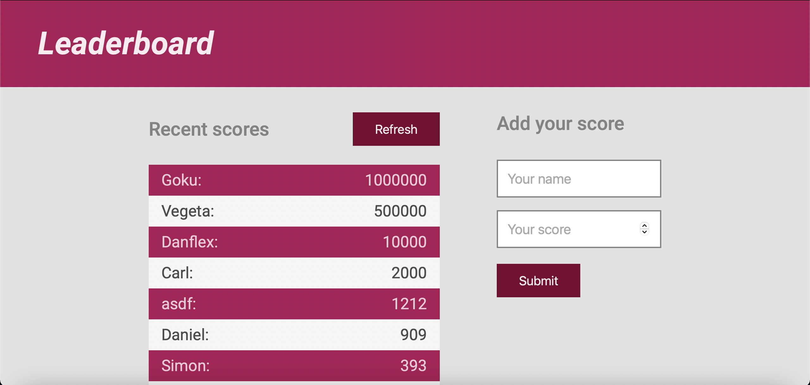

# Leaderboard App

The leaderboard app displays scores submitted by different players. It also allows you to submit your score. The app consumes data stored in an external **API** service located [here](https://www.notion.so/Leaderboard-API-service-24c0c3c116974ac49488d4eb0267ade3).

> I built the app using **webpack** and **ES6** features, such as **modules**.

## About

I built this project using webpack and Vanilla JS. I implemented asynchronous code through **async** and **await** to load scores from the API. The page is fully responsive.

### Features:
- Submit a new score to the leaderboard API
- Get the latest scores
- See scores by highest score
### Live Demo
See demo here [https://github.com/StarSheriff2/Leaderboard-Eureka-JS/](https://starsheriff2.github.io/Leaderboard-Eureka-JS/)

### Built With
- HTML, CSS, JS
- NPM 7.18.1
- Webpack 5.44.0
- HtmlWebpackPlugin
- webpack-dev-server
- Jest 27.0.6
- SASS 1.35.1
- Linters: ESLint, Stylint, WebHint
- VS Code

### About the API
- This app consumes a public API located at https://us-central1-js-capstone-backend.cloudfunctions.net/api/
- The API allows the following calls:
  - Create new game at endpoint `/games/`
  - Submit a new score at endpoint `/games/:id/scores/`
  - Get latest scores from `/games/:id/scores/`
- The API calls are made according to its documentation, which can be accessed [here](https://www.notion.so/Leaderboard-API-service-24c0c3c116974ac49488d4eb0267ade3)

## Getting Started

To get a local copy up and running, follow these simple example steps.

### Prerequisites
- A browser to open the main file
- Node.js
- NPM

### Setup
1. Open your terminal or command prompt.
2. If you do not have git installed in your system, skip this step and go to step 3; otherwise, go to the directory where you want to copy the project files and clone it by copying this text into your command prompt/terminal: `git@github.com:StarSheriff2/Leaderboard-Eureka-JS.git`.
 Now go to the ***"Install Dependencies"*** section
3. Download the program files by clicking on the green button that says “**Code**” on the upper right side of the project frame.
4. You will see a dropdown menu. Click on “**Download ZIP**.”
5. Go to the directory where you downloaded the **ZIP file** and open it. Extract its contents to any directory you want in your system.

### Install Dependencies
1. Go to the root directory of the project
2. In your command line, while in the root dir, type `npm install`. It will install all necessary dependencies in your project files
3. Now type `npm run start`. It will load the project in your default browser.  
**Note: _This command will not stop on its own. If you change something in your project files, it will recompile and reload the page in your browser. To exit, hit "ctrl + c"_**

## Development

### Bundle project
- `npm run build`

### To compile SCSS
- `npm run wsass`
### Testing
To test, run

- `npm test`

### Linters
To run the linters included in this repository, you will need to install them locally. **Note:** You will need node.js for this and npm:
- to install WebHint, run `npm install --save-dev hint@6.x`
- for Stylelint, `npm install --save-dev stylelint@13.x stylelint-scss@3.x stylelint-config-standard@21.x stylelint-csstree-validator@1.x`
- for ESlint, `npm install --save-dev eslint@7.x eslint-config-airbnb-base@14.x eslint-plugin-import@2.x babel-eslint@10.x`

To run the linters, go the root directory of your repository, and copy/paste the following commands in your terminal:
- to check the HTML file, `npx hint`
- to check the stylesheets, `npx stylelint "**/*.{css,scss}"`
- to check the JS files, `npx eslint`

## Usage

- Submit a new score by entering your name and your score
- To see the latest scores submitted by other players, just hit `Refresh`

## Author

👤 **Arturo Alvarez**
- Github: [@StarSheriff2](https://github.com/StarSheriff2)
- Twitter: [@ArturoAlvarezV](https://twitter.com/ArturoAlvarezV)
- Linkedin: [Arturo Alvarez](https://www.linkedin.com/in/arturoalvarezv/)

## 🤝 Contributing

Contributions, issues, and feature requests are welcome!

Feel free to check the [issues page](https://github.com/StarSheriff2/Leaderboard-Eureka-JS/issues).

## Show your support

Give a ⭐️ if you like this project!

## 📝 License

This project is [MIT](https://github.com/StarSheriff2/Leaderboard-Eureka-JS/blob/main/LICENSE) licensed.

